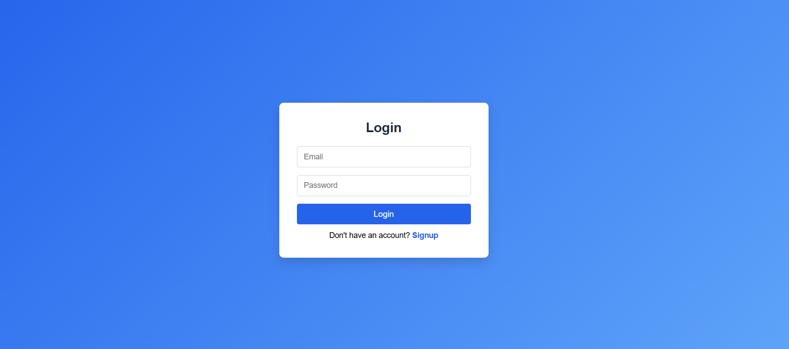
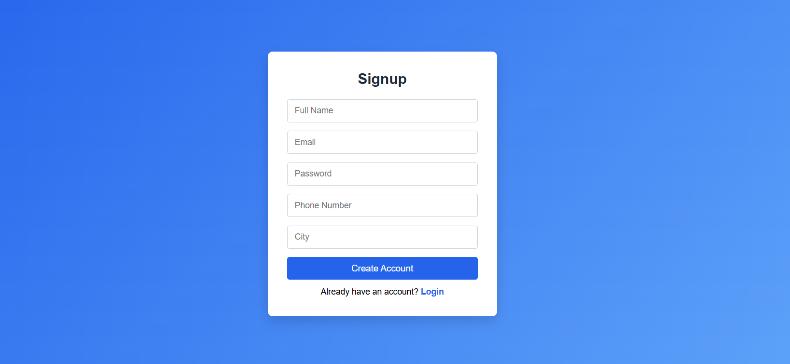
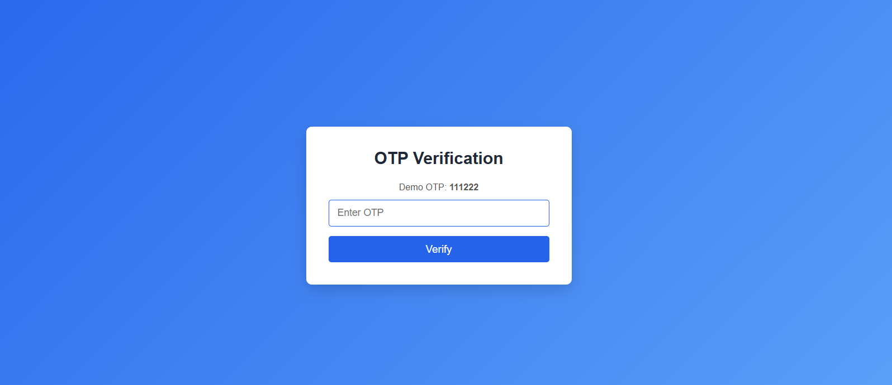
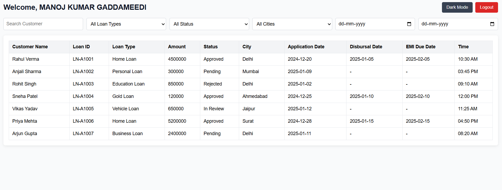
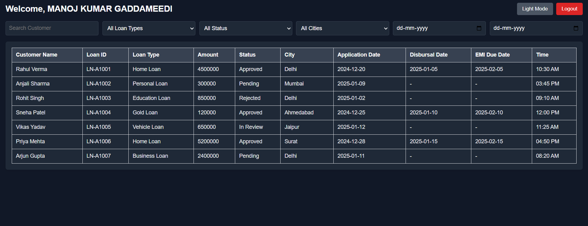

# Loan Management Mini App

## Project Overview
This is a frontend-only Loan Management application built using React.
The project includes user authentication (Signup, Login with OTP) and a dashboard
to view and manage loan records.

All data is handled using browser localStorage. No backend or APIs are used,
as per the assignment requirement.

---

## Setup Instructions

Follow the steps below to run the project locally:

1. Clone the repository
   git clone https://github.com/GADDAMEEDIMANOJKUMAR/loan-management-mini-app.git

2. Navigate to the project folder
   cd loan-management-mini-app

3. Install dependencies
   npm install

4. Start the development server
   npm run dev

5. Open the application in browser
   http://localhost:5173

---

## Features

### Authentication
- User Signup with validation
- Login using Email and Password
- OTP verification after login
- Default demo OTP used for testing
- Error messages for invalid credentials
- Logout functionality

### Signup
- Validation for missing fields
- Duplicate email check
- Successful signup confirmation

### Dashboard
- Display loan details in table format
- Search by customer name
- Filter by loan type
- Filter by loan status
- Filter by city
- Filter by application date range
- Display application date, disbursal date, EMI due date, and time
- Logout with success message

### UI & UX
- Responsive design (mobile and desktop)
- Clean and simple user interface
- Toast notifications for user feedback

---

## Bonus Features Added

- Dark Mode toggle on Dashboard
- Dark mode preference stored in localStorage
- Demo OTP displayed on OTP screen for testing
- Responsive table with horizontal scroll on mobile

---

## Screenshots

- Login Page  
 
 
- Signup Page  
 

- OTP Verification Page  
 

- Dashboard (Light Mode) 
 

- Dashboard (Dark Mode)
 

---

## Technologies Used

- React
- JavaScript
- React Router
- CSS
- localStorage

---

## Project Structure

- pages → Login, Signup, OTP, Dashboard
- components → ProtectedRoute
- data → Static users and loan data
- styles → CSS files
- utils → localStorage helper functions

---

## Notes

- This is a frontend-only project created for assignment purposes.
- localStorage is used to simulate backend functionality.
- OTP is fixed and shown only for demo/testing.

---

## Author

Manoj Kumar Gaddameedi
